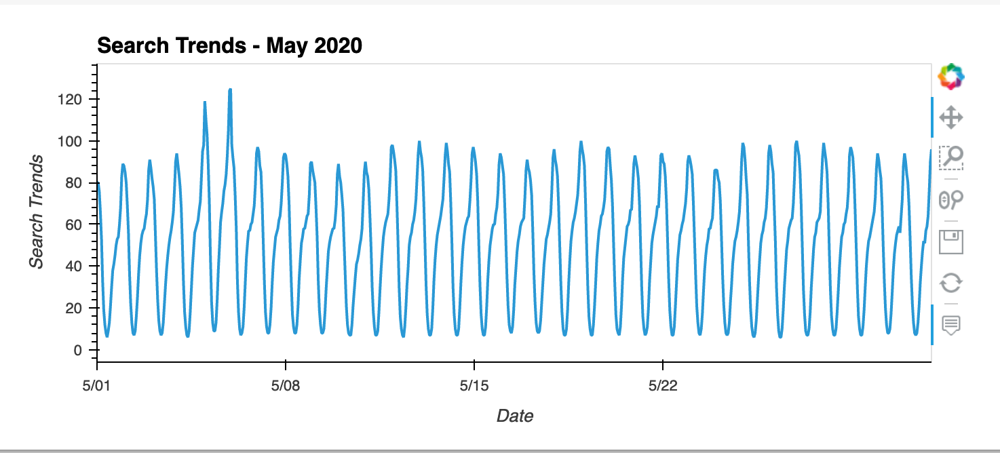
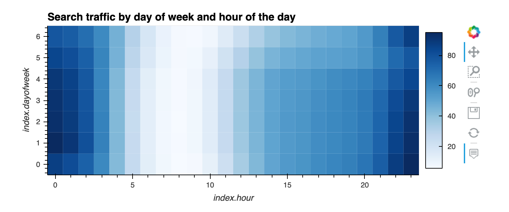
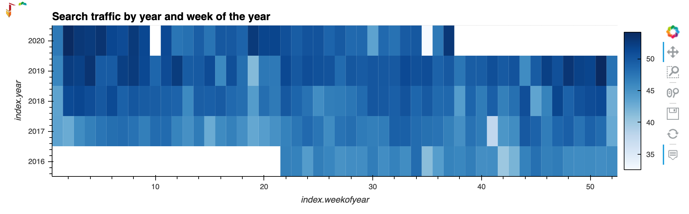
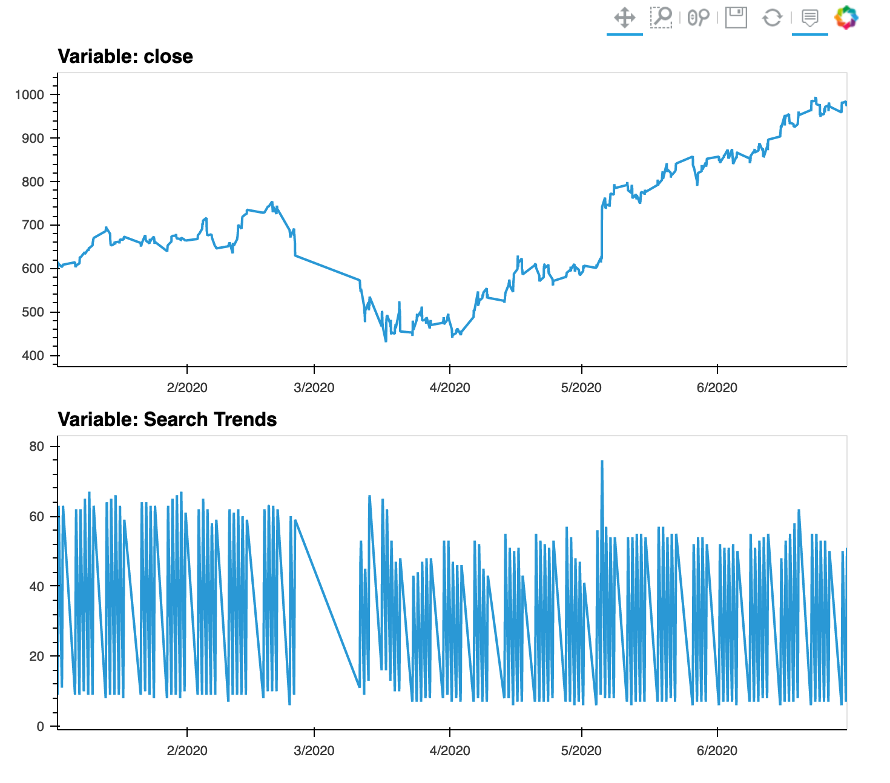
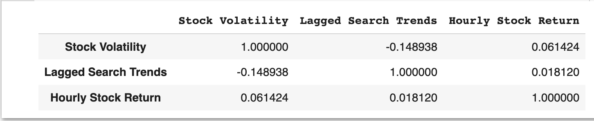
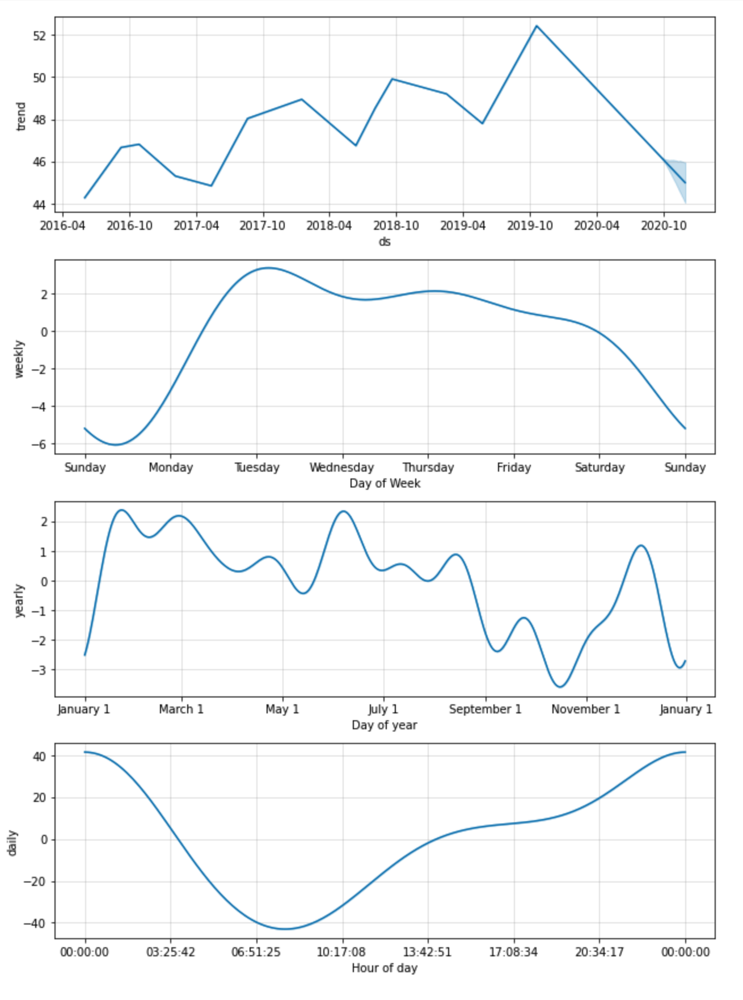

# Predict User Traffic for MercadoLibre

## Case study
With the aim of driving growth and revenue for [Mercado Libre](http://investor.mercadolibre.com/investor-relations), this 
tool imports both financial and user data to a Jupyter notebook, and generates visualisations to understand the time 
series data.

## Data sources
- Google hourly search trends: [google_hourly_search_trends.csv](Resources/google_hourly_search_trends.csv)
- MercadoLibre daily revenue: [mercado_daily_revenue.csv](Resources/mercado_daily_revenue.csv)
- MercadoLibre stock price: [mercado_stock_price.csv](Resources/mercado_stock_price.csv)

## Tasks to support the Analysis of the data
* Visual depictions of seasonality (as measured by Google Search traffic) that are of interest to the company.
* Evaluation of how the company stock price correlates to its Google Search traffic.
* Prophet forecast model that can predict hourly user search traffic.

## Technical Environment
This tool utilises the following technologies:
- **Pandas** [Documentation](https://pandas.pydata.org/docs/reference/frame.html)
- **hvplot** [Documentation](https://hvplot.holoviz.org/getting_started/hvplot.html)
- **sklearn** [Documentation](https://scikit-learn.org/stable/)
- **HoloViews** [Documentation](https://holoviews.org/)
- **Prophet** [Documentation](https://facebook.github.io/prophet/)
- **Matplotlib** [Documentation](https://matplotlib.org/)

## Disclaimer
> Please be aware this is an Academic Case Study. The conclusions from this work should not be considered as financial 
> advice.

- - - - - - - - - - - - - - -
## Report

### Visual depictions of seasonality

Total search traffic for May 2020: `38181`

Overall monthly median search traffic: `35172.5`
> There is an increase in the Google search trends for May 2020 compared to the overall monthly median value.

Note: The day of the week with Monday=0, Sunday=6

> The highest concentration of traffic occurs every day from 10:00 pm to 2:00 am, specially between Sunday evening and 
> Friday morning. Friday and Saturday evenings are less active compare with the rest of the days. This means the company 
> can get a higher ROI by focusing the marketing strategies to the evenings.

> It looks like the traffic goes up slightly during the holiday period, but the search trend is not very clear using a 
> heatmap. Other techniques are required to better identify seasonality.

### Correlation of Search Traffic to Stock Price Patterns

> Based on both graphs it doesn't look like there is any common trend between the Closing price of MercadoLibre stocks 
> and the Search traffic.

> There is no significant correlation between the lagged search traffic and the stock volatility. Similarly, there is no 
> correlation between the lagged search traffic and the stock price returns.

### Prophet forecast model

> Similar to the Heatmap plot, the Prophet model indicates the time with the most search traffic is from 10 pm to 2 am.
> Tuesday is the day of the week with the most search traffic.
> The lowest point for the Search Traffic in the years seems to be around October.